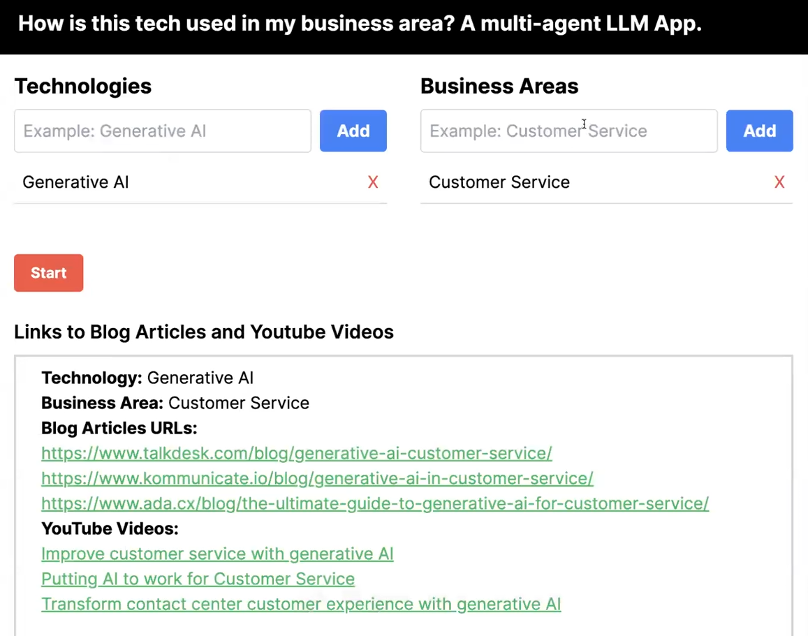

# Fullstack-Multi-Agent-LLM-App-with-CrewAI
An advanced Fullstack-Multi-Agent LLM Application using CrewAI


# Goal
To find blog articles and youtube video interviews talking about selected technologies in the selected business areas.

 The goal is to create a crew of agents for every request the user sends us. In other words, each time a user request a task (online research about some technology in some business area), we want to create a separate crew of agents to do that.

 # Use Case:
  Find youtube video interviews and blog posts about Generative AI in the customer service area.


# How to run?
### STEPS:

```bash
Project repo: https://github.com/
```
### STEP 01- Create a Poetry environment after opening the repository 

# In terminal:

```bash
cd project_name
pyenv local 3.11.4
poetry install
poetry shell
```


### Create a `.env` file in the root directory and here is where you will add your confidential api keys. Remember to include:

```bash
OPENAI_API_KEY=your_openai_api_key
YOUTUBE_API_KEY=CopyYourApiKeyHere
LANGCHAIN_TRACING_V2=true 
LANGCHAIN_ENDPOINT=https://api.smith.langchain.com 
LANGCHAIN_API_KEY=your_langchain_api_key 
LANGCHAIN_PROJECT=your_project_name
SERPER_API_KEY=yourApiKey
```
# Open 2 terminal windows:
In one, start the backend.
In the second, start the front (check how to run that under frontend section)

Now,
```bash
cd backend
python api.py
```


### FrontEnd

The [Next.js](https://nextjs.org/) project bootstrapped with [`create-next-app`](https://github.com/vercel/next.js/tree/canary/packages/create-next-app).

## Getting Started

First, run the development server:

```bash
npm run dev
# or
yarn dev
# or
pnpm dev
# or
bun dev
```

Open [http://localhost:3000](http://localhost:3000) with your browser to see the result.

You can start editing the page by modifying `app/page.tsx`. The page auto-updates as you edit the file.

This project uses [`next/font`](https://nextjs.org/docs/basic-features/font-optimization) to automatically optimize and load Inter, a custom Google Font.

## Learn More

To learn more about Next.js, take a look at the following resources:

- [Next.js Documentation](https://nextjs.org/docs) - learn about Next.js features and API.
- [Learn Next.js](https://nextjs.org/learn) - an interactive Next.js tutorial.

You can check out [the Next.js GitHub repository](https://github.com/vercel/next.js/) - your feedback and contributions are welcome!

## Deploy on Vercel

The easiest way to deploy your Next.js app is to use the [Vercel Platform](https://vercel.com/new?utm_medium=default-template&filter=next.js&utm_source=create-next-app&utm_campaign=create-next-app-readme) from the creators of Next.js.

Check out our [Next.js deployment documentation](https://nextjs.org/docs/deployment) for more details.


```bash
# In second terminal, start the frontend.
 cd frontend
 npm run dev
 See the app in http://localhost:3000.
```

### Techstack Used:
  - Python
  - Next.js(React,Javascript)
  - CrewAI(LangChain)
  - Flask backend (python)
  - Postman
  - Vercel

### Final UI

  